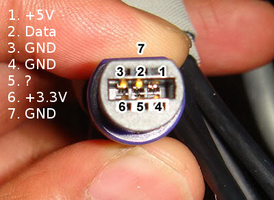
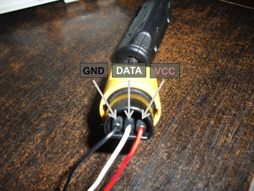

# N64PadForArduino - Nintendo 64/GameCube controller interface library for Arduino
N64PadForArduino is an Arduino library that allows interfacing controllers designed for the Nintendo 64 and GameCube with Arduino boards.

The N64/GC controller protocol is pretty fast, as every bit is 4 microseconds long. Consequently, "slow" CPUs have a hard time decoding it. There are a few code samples out there but they are unreliable, so I set to write the one library to rule them all.

## Features
Currently, N64PadForArduino provides access to all buttons and axes available on N64 and GC controllers.

It does NOT allow interacting with the Memory Pak on N64 controllers nor driving the vibration motors available on GC controllers. I'm not interested in these feature, but if you are, please open an Issue saying so. If many people ask, I will look into them.

## Using the Library
The N64/GC protocol only uses a single data pin, which is driven in an open-collector fashion.

The N64 protocol is so fast that the only reliable way to decode it on a 16 MHz Arduino is using interrupts. The library supports both *external* interrupts (i.e.: INT0, INT1, etc.) and *pin-change* interrupts (PCINT0, PCINT1, etc.), so you can use almost any pin. The biggest drawback is that you must choose your pin at compile time. This can be done in the [pinconfig.h file](https://github.com/SukkoPera/N64PadForArduino/blob/master/src/protocol/pinconfig.h). By default, it will use pin 2 on an Arduino Uno and pin 3 on a Leonardo.

On the Leonardo, the library will also use Timer1, since it needs to disable the Timer0 interrupt (the one used by `millis()`) while it's talking with the controller for reliability reasons.

Once you have chosen your pin, you can just refer to the [example sketches](https://github.com/SukkoPera/N64PadForArduino/tree/master/examples/) to learn how to use this library, as the interface should be quite straightforward.

The API has a few rough edges and is not guaranteed to be stable, but any changes will be to make it easier to use.

Among the examples, there is one which will turn any N64/GC controller into a USB one simply by using an Arduino Leonardo or Micro. It is an excellent way to make a cheap adapter and to test the controller and library.

## Wiring the Controller
N64/GC controllers all work at 3.3V. They don't seem to require much current (if someone has exact figures, please provide them) so they will be happy with power from the Uno onboard 3.3V regulator, which is known to only be able to provide about 50mA.

GC controllers also have a 5V pin, but that seems to only be used to power the rumble motors. Since this library doesn't currently support them, it can be left unconnected.

You will NOT need any level translator for the data pin. This is because the pin is driven in an open-collector fashion, which never puts voltage on the line but lets a pull-up resistor do the job. Controllers seem to have this pull-up resistor internally, but you might want/need to add an external one, say 1-10k (I'd start with 2.2k since the line must rise quickly). Wire it to 3.3V of course.

## Compatibility List
N64PadForArduino was primarily tested with official Nintendo controllers, but it aims to be compatible with all devices. If you find one that doesn't work, please open an issue and I'll do my best to add support for it.

## Debugging
If you have problems, uncomment the `DUMP_COMMS` #define in [N64PadForArduino.h](https://github.com/SukkoPera/N64PadForArduino/blob/master/src/N64PadForArduino.h#L33) and watch your serial monitor.

## Releases
If you want to use this library, you are recommended to get [the latest release](https://github.com/SukkoPera/N64PadForArduino/releases) rather than the current git version, as the latter might be under development and is not guaranteed to be working.

Every release is accompanied by any relevant notes about it, which you are recommended to read carefully.

## License
N64PadForArduino is released under the GNU General Public License (GPL) v3. If you make any modifications to the library, **you must** contribute them back.

N64PadForArduino is provided to you ‘as is’ and without any express or implied warranties whatsoever with respect to its functionality, operability or use, including, without limitation, any implied warranties of merchantability, fitness for a particular purpose or infringement. We expressly disclaim any liability whatsoever for any direct, indirect, consequential, incidental or special damages, including, without limitation, lost revenues, lost profits, losses resulting from business interruption or loss of data, regardless of the form of action or legal theory under which the liability may be asserted, even if advised of the possibility or likelihood of such damages.

## Thanks
- [James Ward](http://www.int03.co.uk/crema/hardware/gamecube/gc-control.htm)
- [Andrew](https://www.mixdown.ca/n64dev/)
- All the other guys who helped understand how the N64/GC controller protocol works.
